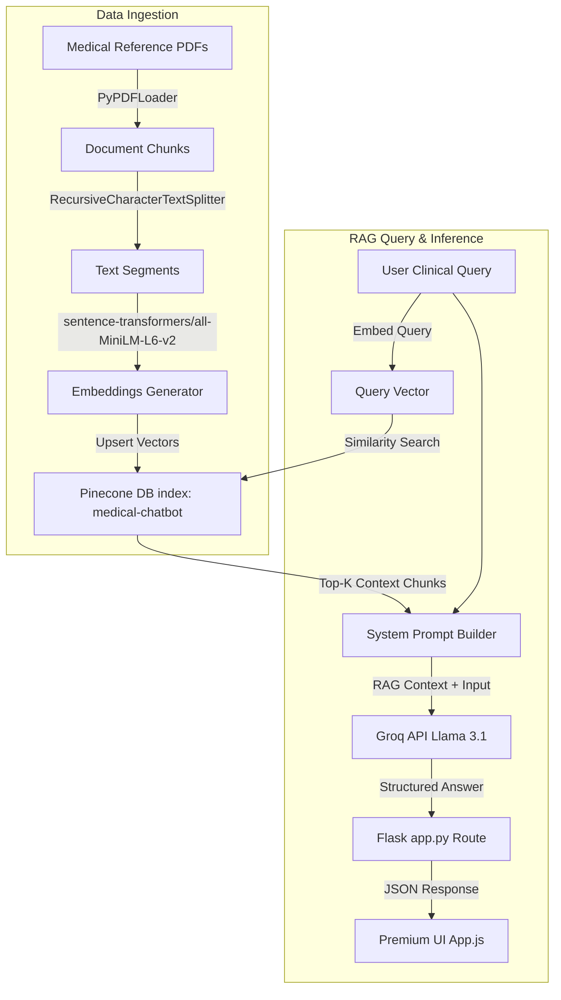

# AURA MedAI — Cognitive Clinical Intelligence System

AURA MedAI is a high-fidelity, premium medical diagnostic command console and Retrieval-Augmented Generation (RAG) assistant. The application leverages PDF medical books (under `data/`), encodes them into vector embeddings, indexes them in a Pinecone vector database, and queries Groq's Llama-3.1-8b model using retrieved context to provide accurate diagnostic references alongside source citations.

---

## 🖥️ User Interface Overview
The user interface is designed with a premium, dark-themed medical sci-fi diagnostic aesthetic:
- **System Connectivity Monitor**: Live health checks for API endpoints (Groq and Pinecone) displaying connectivity statuses.
- **Glassmorphic Chat Interface**: Responsive conversation panel featuring smooth animation entries, typing indicators, and markdown formatting.
- **Real-Time ECG Vitals Simulator**: Animated vector SVG wave representing heart rate and body temperature vitals.
- **Dynamic Citation Sidebar**: Cards displaying referenced document excerpts. Clicking on any reference opens a detailed modal detailing target book sources and text snippets.

---

## 🏗️ Architecture & Data Flow



---

## 🛠️ Tech Stack & Requirements

- **Backend Framework**: Flask (Python 3.9+)
- **LLM Engine**: LangChain & ChatGroq (`llama-3.1-8b-instant`)
- **Vector Database**: Pinecone (`langchain-pinecone`)
- **Embeddings Model**: Sentence Transformers (`sentence-transformers/all-MiniLM-L6-v2`)
- **Frontend Layer**: HTML5, Vanilla CSS3 (Glassmorphism + custom animations), JavaScript (ES6 fetch API)

---

## 🚀 Getting Started & Setup Guide

### 1. Prerequisites & Environment Setup
Clone the project, then configure a virtual environment and install the required dependencies:

```bash
# Navigate to the workspace directory
cd medicalbot

# Create and activate a Python virtual environment (optional but recommended)
python -m venv venv
venv\Scripts\activate

# Install all required libraries
pip install -r requirements.txt
```

### 2. Configure API Credentials
Create a `.env` file in the root directory and add your secret keys. Make sure it is ignored by Git:

```env
PINECONE_API_KEY=your_pinecone_api_key_here
GROQ_API_KEY=your_groq_api_key_here
```

### 3. Load & Index Medical Books
Place your clinical guidelines or reference books in PDF format inside the `data/` folder (e.g. `data/Medical_book.pdf`). Run the indexing script to parse the files, convert them to vectors, and upsert them to Pinecone:

```bash
# Ingest and embed PDF documents
python store_index.py
```

### 4. Launch the Diagnostics Dashboard
Run the Flask server locally:

```bash
# Start the web app server
python app.py
```

The application will run on **`http://localhost:8080`**. Open this URL in any web browser to access the dashboard.

---

## 📖 How to Use the Console

1. **Check System Connection**: Verify that both the **Groq Inference** and **Pinecone DB** LEDs in the left panel show green (Operational).
2. **Consult AURA**: Type clinical inquiries into the input text area (e.g., `"What is acne?"` or `"Treatment for acromegaly"`).
3. **Examine Citations**: The citations sidebar will render citation cards matching relevant book snippets. Click any card to inspect the full excerpt in the interactive modal.
4. **Clean Consultation**: Click the refresh icon in the upper right header to clear conversation history.

---

## ⚠️ Clinical Disclaimer
AURA MedAI is an informational diagnostic aid for clinical reference purposes and should not be used as a replacement for professional medical diagnosis, treatment, or emergency clinical decisions.
