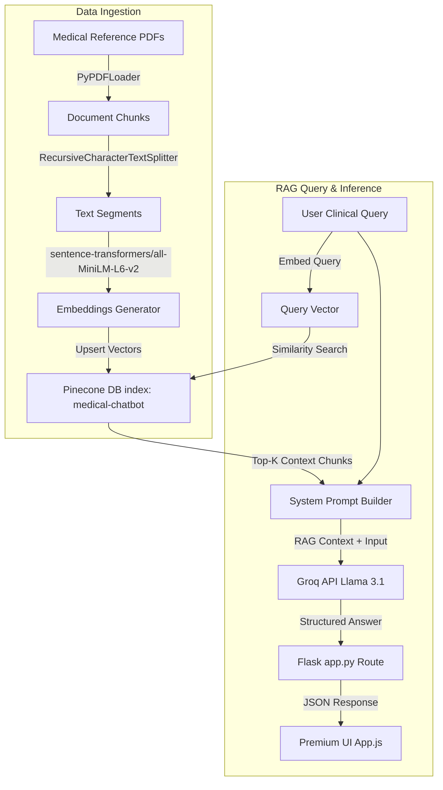

# AURA MedAI — Cognitive Clinical Intelligence System

AURA MedAI is a high-fidelity, premium medical diagnostic command console and Retrieval-Augmented Generation (RAG) assistant. The application leverages PDF medical books (under `data/`), encodes them into vector embeddings, indexes them in a Pinecone vector database, and queries Groq's Llama-3.1-8b model using retrieved context to provide accurate diagnostic references alongside source citations.

---

## 🖥️ User Interface Overview
The user interface is designed with a premium, dark-themed medical sci-fi diagnostic aesthetic:
- **System Connectivity Monitor**: Live health checks for API endpoints (Groq and Pinecone) displaying connectivity statuses.
- **Glassmorphic Chat Interface**: Responsive conversation panel featuring smooth animation entries, typing indicators, and markdown formatting.
- **Real-Time ECG Vitals Simulator**: Animated vector SVG wave representing heart rate and body temperature vitals.
- **Dynamic Citation Sidebar**: Cards displaying referenced document excerpts. Clicking on any reference opens a detailed modal detailing target book sources and text snippets.

---

## 🏗️ Architecture & Data Flow



---

## 🛠️ Tech Stack & Requirements

- **Backend Framework**: Flask (Python 3.9+)
- **LLM Engine**: LangChain & ChatGroq (`llama-3.1-8b-instant`)
- **Vector Database**: Pinecone (`langchain-pinecone`)
- **Embeddings Model**: Sentence Transformers (`sentence-transformers/all-MiniLM-L6-v2`)
- **Frontend Layer**: HTML5, Vanilla CSS3 (Glassmorphism + custom animations), JavaScript (ES6 fetch API)

---

## 🚀 Getting Started & Setup Guide

### 1. Prerequisites & Environment Setup
Clone the project, then configure a virtual environment and install the required dependencies:

```bash
# Navigate to the workspace directory
cd medicalbot

# Create and activate a Python virtual environment (optional but recommended)
python -m venv venv
venv\Scripts\activate

# Install all required libraries
pip install -r requirements.txt
```

### 2. Configure API Credentials
Create a `.env` file in the root directory and add your secret keys. Make sure it is ignored by Git:

```env
PINECONE_API_KEY=your_pinecone_api_key_here
GROQ_API_KEY=your_groq_api_key_here
```

### 3. Load & Index Medical Books
Place your clinical guidelines or reference books in PDF format inside the `data/` folder (e.g. `data/Medical_book.pdf`). Run the indexing script to parse the files, convert them to vectors, and upsert them to Pinecone:

```bash
# Ingest and embed PDF documents
python store_index.py
```

### 4. Launch the Diagnostics Dashboard
Run the Flask server locally:

```bash
# Start the web app server
python app.py
```

The application will run on **`http://localhost:8080`**. Open this URL in any web browser to access the dashboard.

---

## 📖 How to Use the Console

1. **Check System Connection**: Verify that both the **Groq Inference** and **Pinecone DB** LEDs in the left panel show green (Operational).
2. **Consult AURA**: Type clinical inquiries into the input text area (e.g., `"What is acne?"` or `"Treatment for acromegaly"`).
3. **Examine Citations**: The citations sidebar will render citation cards matching relevant book snippets. Click any card to inspect the full excerpt in the interactive modal.
4. **Clean Consultation**: Click the refresh icon in the upper right header to clear conversation history.

---

## ⚠️ Clinical Disclaimer
AURA MedAI is an informational diagnostic aid for clinical reference purposes and should not be used as a replacement for professional medical diagnosis, treatment, or emergency clinical decisions.

---

## ⚙️ AWS CI/CD Deployment with GitHub Actions

### 1. Login to AWS Console

Sign in to your AWS account and navigate to the AWS Management Console.

---

### 2. Create an IAM User for Deployment

Navigate to:

```text
AWS Console → IAM → Users → Create User
```

Create a dedicated IAM user (e.g., `auramed-admin`) for CI/CD deployments.

#### Permissions Required

Attach the following policies:

* AmazonEC2ContainerRegistryFullAccess
* AmazonEC2FullAccess

#### Create Access Keys

After creating the user:

```text
IAM User → Security Credentials → Create Access Key
```

Choose:

```text
Local Code
```

Save the following credentials securely:

```text
AWS_ACCESS_KEY_ID
AWS_SECRET_ACCESS_KEY
```

---

### 3. Create an Amazon ECR Repository

Navigate to:

```text
AWS Console → Elastic Container Registry (ECR) → Create Repository
```

Recommended Configuration:

```text
Repository Visibility : Private
Tag Mutability        : Mutable
Scan on Push          : Enabled
Encryption            : AES-256
```

Example Repository:

```text
medicalbot
```

Save the repository URI:

```text
<aws-account-id>.dkr.ecr.<region>.amazonaws.com/medicalbot
```

Example:

```text
315865595366.dkr.ecr.us-east-1.amazonaws.com/medicalbot
```

---

### 4. Create an EC2 Instance

Launch an Ubuntu EC2 instance.

Recommended:

```text
AMI          : Ubuntu
Instance Type: t2.micro / t3.micro
```

Configure Security Group:

| Type       | Port |
| ---------- | ---- |
| SSH        | 22   |
| HTTP       | 80   |
| HTTPS      | 443  |
| Custom TCP | 8080 |

---

### 5. Install Docker on EC2

#### Update Packages

```bash
sudo apt-get update -y
sudo apt-get upgrade -y
```

#### Install Docker

```bash
curl -fsSL https://get.docker.com -o get-docker.sh

sudo sh get-docker.sh
```

#### Configure Docker Permissions

```bash
sudo usermod -aG docker ubuntu

newgrp docker
```

#### Verify Installation

```bash
docker --version
```

---

### 6. Configure EC2 as a GitHub Self-Hosted Runner

Navigate to:

```text
GitHub Repository
→ Settings
→ Actions
→ Runners
→ New Self-Hosted Runner
```

Choose:

```text
Linux
```

Execute all commands provided by GitHub on the EC2 instance.

Start the runner:

```bash
./run.sh
```

You should see:

```text
✓ Connected to GitHub

Listening for Jobs
```

---

### 7. Configure GitHub Secrets

Navigate to:

```text
GitHub Repository
→ Settings
→ Secrets and Variables
→ Actions
```

Create the following secrets:

```text
AWS_ACCESS_KEY_ID
AWS_SECRET_ACCESS_KEY
AWS_DEFAULT_REGION
ECR_REPO
PINECONE_API_KEY
GROQ_API_KEY
```

Example:

```text
AWS_DEFAULT_REGION = us-east-1
ECR_REPO           = medicalbot
```

---

### 8. CI/CD Workflow

The GitHub Actions pipeline performs the following steps automatically:

1. Checkout source code from GitHub
2. Build Docker image
3. Push Docker image to Amazon ECR
4. Trigger deployment on EC2 Self-Hosted Runner
5. Pull latest image from ECR
6. Launch updated Docker container
7. Serve the application to end users

```text
GitHub
   ↓
GitHub Actions
   ↓
Docker Build
   ↓
Amazon ECR
   ↓
EC2 Self-Hosted Runner
   ↓
Docker Container
   ↓
Production Application
```

---

### 9. Verify Deployment

Check running containers:

```bash
docker ps
```

View logs:

```bash
docker logs <container_id>
```

Access the application:

```text
http://<EC2-PUBLIC-IP>:8080
```

Example:

```text
http://52.xxx.xxx.xxx:8080
```

